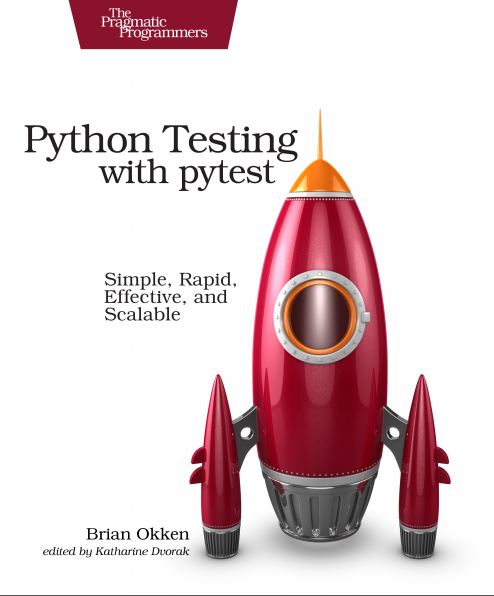

# По книге Briann Okken. Python Testing with pytest

**[`Запуск тестов`](#запуск-тестов)**__:__
**[`Выполнение только одного теста`](#выполнение-только-одного-теста)**

**[`Названия для тестов`](#какими-должны-быть-названия-чтобы-pytest-обнаруживал-тесты)**\
**[`Результат запуска одного файла`](#результат-запуска-одного-файла)**

**[`Использование опций`](#использование-опций)**__:__
**[`--collect-only`](#1)**__,__
**[`-k EXPRESSION`](#2)**__,__
**[`-m MARKEXPR`](#3)**__,__
**[`-x, --exitfirst`](#4)**__,__
**[`--maxfail=num`](#5)**__,__
**[`-s and --capture=method`](#6)**__,__
**[`-lf, --last-failed`](#7)**__,__
**[`–ff, --failed-first`](#8)**__,__
**[`-v, --verbose`](#9)**__,__
**[`-q, --quiet`](#10)**__,__
**[`-l, --showlocals`](#11)**__,__
**[`--tb=style`](#12)**__,__
**[`--durations=N`](#13)**__,__
**[`--version`](#14)**__,__
**[`-h, --help`](#15)**

**[`Импорт пакетов`](#импорт-пакетов)**\
**[`Ожидание Исключений`](#ожидание-исключений)**\
**[`Marking Test Functions`](#marking-test-functions)**\
**[`Пропуск Тестов`](#пропуск-тестов)**\
**[`Маркировка тестов ожидающих сбоя`](#маркировка-тестов-ожидающих-сбоя)**

**[`Выполнение подмножества тестов`](#выполнение-подмножества-тестов)**__:__
**[`A Single Directory`](#a-single-directory)**__,__
**[`Одиночный тест`](#одиночный-тест)**__,__
**[`Одиночная тестовая функция`](#одиночная-тестовая-функция)**__,__
**[`Одиночный Test Class`](#одиночный-test-class)**__,__
**[`A Single Test Method of a Test Class`](#a-single-test-method-of-a-test-class)**__,__
**[`Набор тестов на основе базового имени теста`](#набор-тестов-на-основе-базового-имени-теста)**

**[`Параметризованное тестирование`](#параметризованное-тестирование)**__:__
**[`Параметризация с одним параметром`](#параметризация-с-одним-параметром)**__,__\
**[`Параметризация с несколькими параметрами`](#параметризация-с-несколькими-параметрами)**__,__
**[`Параметризация переменной`](#параметризация-переменной)**__,__
**[`Параметр ids для parametrize`](#параметр-ids-для-parametrize)**__,__
**[`Параметризация в классах`](#параметризация-в-классах)**__,__
**[`Идентификация параметров`](#идентификация-параметров)**

**[`Fixtures`](#fixtures)**__:__
**[`Обмен Fixtures через conftest`](#обмен-fixtures-через-conftest)**__,__
**[`Использование Fixtures вместо Setup и Teardown`](#использование-fixtures-вместо-setup-и-teardown)**__,__
**[`Трассировка Fixture Execution с setup show`](#трассировка-fixture-execution-с-setup-show)**__,__
**[`Использование Fixtures для Test Data`](#использование-fixtures-для-test-data)**__,__
**[`Использование Multiple Fixtures`](#использование-multiple-fixtures)**__,__


___

# Краткое описание:

Здесь собраны мои заметки по книге Brian Okken - Python Testing with pytest.
Для тех, кто знает `pytest` или прочитал эту замечательную книгу - данный файл
может служить справочником.\
По каждому разделу можно быстро перемещаться пользуясь оглавлением или
локальными ссылками в разделах.\
Для быстрого ориентирования в каждом разделе предусмотрена ссылка,
возвращающая к оглавлению.


___

## Запуск тестов:

Весь путь в примерах указывается относительно текущего местоположения\
Запустить тесты можно командой в терминале `pytest`, где указывается директория,
откуда производится запуск тестов или перечисляются файлы, содержащие тесты.\
`pytest .` запустит все тесты.\
Можно указать только отдельные файлы для запуска:\
`pytest tests` или `pytest tests/test_calculator.py tests/tasks/test_three.py`\
При указании флага `-v` будет показана дополнительная информация.

Обязательно использовать кавычки, если в идентификаторе есть пробелы. Подробнее
[тут](#параметризация-с-несколькими-параметрами)

**Запускать можно:**

- Одиночную директорию. [Читать подробнее](#a-single-directory)
- Одиночные тесты. [Читать подробнее](#одиночный-тест)
- Одиночные классы. [Читать подробнее](#одиночный-test-class)
- Одиночные функции из класса. [Читать подробнее](#a-single-test-method-of-a-test-class)
- Одиночные функции. [Читать подробнее](#одиночная-тестовая-функция)
- Одиночные функции по названию с помощью флага `-k`. [Читать подробнее](#2)
- Одиночные параметры у параметризованной функции. [Читать подробнее](#параметризация-с-несколькими-параметрами)
- Набор тестов на основе базового имени теста. [Читать подробнее](#набор-тестов-на-основе-базового-имени-теста)
- Набор тестов на основе маркеров. [Читать подробнее](#marking-test-functions)
- Все тесты разом. Настраивается в конфигурации (ищет все тесты во всем проекте)
- Все тесты, кроме указанных маркером. [Читать подробнее](#пропуск-тестов)

Часть выполнения `pytest`, где `pytest` проходит и находит, какие тесты запускать,
называется `test discovery` (тестовым обнаружением)

#### Выполнение только одного теста:

Указать файл напрямую и добавить `::test_name`\
`$ pytest -v tasks/test_four.py::test_asdict`

[К оглавлению](#по-книге-briann-okken-python-testing-with-pytest)

## Какими должны быть названия, чтобы pytest обнаруживал тесты:

- Тестовые файлы должны быть названы `test_<something>.py` или `<something>_test.py`.
- Методы и функции тестирования должны быть названы `test_<something>`.
- Тестовые классы должны быть названы `Test<Something>`.

Чтобы изменить эти правила, нужно вносить правки в конфигурации

[К оглавлению](#по-книге-briann-okken-python-testing-with-pytest)

## Результат запуска одного файла

```
$ cd /path/to/code/ch1/tasks
$ pytest test_three.py
================= test session starts ==================
platform darwin -- Python 3.6.2, pytest-3.2.1, py-1.4.34, pluggy-0.4.0
rootdir: /path/to/code/ch1/tasks, inifile:
collected 2 items
test_three.py ..
=============== 2 passed in 0.01 seconds ===============
```

Платформа darwin — Mac. На компьютере с ОС Windows
платформа отличается.\
Далее перечислены версии Python и `pytest`, а также зависимости от
пакетов `pytest`.\
И `py`, и `pluggy` — это пакеты, разработанные командой `pytest`, чтобы
помочь с реализацией pytest.

[К оглавлению](#по-книге-briann-okken-python-testing-with-pytest)

#### rootdir: /path/to/code/ch1/tasks, inifile:

`rootdir` — это самый верхний общий каталог для всех каталогов
в которых ищется тестовый код.\
В `inifile` (здесь пустой) перечислены используемые файлы
конфигурации.\
Конфигурационными файлами могут быть `pytest.ini`,
`tox.ini` или `setup.cfg`.

#### collected 2 items

Это две тестовые функции в файле.

#### test_three.py ..

`test_three.py` показывает тестируемый файл. Для каждого тестового
файла есть одна строка. Две точки означают, что тесты пройдены — по
одной точке для каждой тестовой функции или метода. Точки
предназначены только для прохождения тестов. `Failures` (сбоев),
`errors` (ошибок), `skips` (пропусков), `xfails`, и `xpasses` обозначаются
с `F`, `E`, `s`, `x`, и `Х`, соответственно. Если вы хотите видеть больше
точек для прохождения тестов, используйте опцию `-v` или `--verbose`.

#### == 2 passed in 0.01 seconds ==

Эта строка относится к числу пройденных тестов и времени, затраченному
на весь сеанс тестирования. При наличии непроходных тестов здесь
также будет указан номер каждой категории.

#### Возможные результаты тестовой функции:

- PASSED (.): Тест выполнен успешно.
- FAILED (F): Тест не выполнен успешно (или XPASS + strict).
- SKIPPED (s): Тест был пропущен. Вы можете заставить pytest
  пропустить тест, используя декораторы `@pytest.mark.skip()` или
  `pytest.mark.skipif()`
- xfail (x): Тест не должен был пройти, был запущен и провалился.
  Вы можете принудительно указать pytest, что тест должен
  завершиться неудачей, используя декоратор `@pytest.mark.xfail()`
- XPASS (X): Тест не должен был пройти, был запущен и прошел!..
- ERROR (E): Исключение произошло за пределами функции тестирования,
  либо в фикстуре

[К оглавлению](#по-книге-briann-okken-python-testing-with-pytest)

## Использование опций:

Ознакомиться с полным списком опций можно командой `pytest --help`

###### 1

#### --collect-only

Параметр `--collect-only` показывает, какие тесты будут выполняться
с заданными параметрами и конфигурацией.
Параметр `--collect-only` полезен для проверки правильности выбора
других опций, которые выбирают тесты перед запуском тестов

[К оглавлению](#по-книге-briann-okken-python-testing-with-pytest)

###### 2

#### -k EXPRESSION

Параметр `-k` позволяет использовать выражение для определения
функций тестирования.
Её можно использовать как ярлык для запуска отдельного теста,
если имя уникально, или запустить набора тестов, которые имеют
общий префикс или суффикс в их именах. Предположим, вы хотите
запустить тесты `test_asdict()` и `test_defaults()`. Вы можете
проверить фильтр с помощью: `--collect-only`

```
$ cd /path/to/code/ch1
$ pytest -k "asdict or defaults" --collect-only
=================== test session starts ===================
collected 6 items
<Module 'tasks/test_four.py'>
  <Function 'test_asdict'>
<Module 'tasks/test_three.py'>
  <Function 'test_defaults'>
=================== 4 tests deselected ====================
============== 4 deselected in 0.03 seconds ===============
```

Теперь можно запустить их, удалив `--collect-only`

```
$ pytest -k "asdict or defaults"
=================== test session starts ===================
collected 6 items
tasks/test_four.py .
tasks/test_three.py .
=================== 4 tests deselected ====================
========= 2 passed, 4 deselected in 0.03 seconds ==========
```

Просто точки. Так значит они прошли. Но были ли они правильными
тестами? Один из способов узнать — использовать `-v` или `--verbose`:

```
$ pytest -v -k "asdict or defaults"
=================== test session starts ===================
collected 6 items
tasks/test_four.py::test_asdict PASSED
tasks/test_three.py::test_defaults PASSED
=================== 4 tests deselected ====================
========= 2 passed, 4 deselected in 0.02 seconds ==========
```

[К оглавлению](#по-книге-briann-okken-python-testing-with-pytest)

###### 3

#### -m MARKEXPR

Маркеры-один из лучших способов пометить подмножество тестовых
функций для совместного запуска. В качестве примера, один из
способов запустить `test_replace()` и `test_member_access()`, даже
если они находятся в отдельных файлах, это пометить их. Можно
использовать любое имя маркера. Допустим, вы хотите использовать
`run_these_please`. Отметим тесты, используя декоратор
`@pytest.mark.run_these_please`, вот так:

```python
import pytest

...


@pytest.mark.run_these_please
def test_member_access():
    ...
```

Теперь то же самое для `test_replace()`. Затем вы можете запустить
все тесты с тем же маркером с помощью `pytest -m run_these_please`:

```
$ cd /path/to/code/ch1/tasks
$ pytest -v -m run_these_please
================== test session starts ===================
collected 4 items
test_four.py::test_replace PASSED
test_three.py::test_member_access PASSED
=================== 2 tests deselected ===================
========= 2 passed, 2 deselected in 0.02 seconds =========
```

Выражение маркера необязательно должно быть одним маркером.
Вы можете использовать такие варианты, как -m "mark1 and mark2"
для тестов с обоими маркерами, -m "mark1 and not mark2" для тестов,
которые имеют метку 1, но не метку 2, -m "mark1 or mark2" для тестов
с одним из и т. д.

[К оглавлению](#по-книге-briann-okken-python-testing-with-pytest)

###### 4

#### -x, --exitfirst

Нормальным поведением pytest является запустить все тесты, которые
он найдет. Если тестовая функция обнаружит сбой `assert` или `exception`,
выполнение этого теста останавливается, и тест завершается ошибкой.
И тогда `pytest` запускает следующий тест. По большей части, это то что
надо. Однако, особенно при отладке проблемы, мешает сразу всей тестовой
сессии, когда тест не является правильным. Вот что делает `-x` опция:

```
$ cd /path/to/code/ch1
$ pytest -x
====================== test session starts ====================
collected 6 items
test_one.py .
test_two.py F
============================ FAILURES =========================
__________________________ test_failing _______________________
    def test_failing():
>       assert (1, 2, 3) == (3, 2, 1)
E       assert (1, 2, 3) == (3, 2, 1)
E         At index 0 diff: 1 != 3
E         Use -v to get the full diff
test_two.py:2: AssertionError
=============== 1 failed, 1 passed in 0.38 seconds ============
```

В верхней части выходных данных вы видите, что все шесть тестов
(или “элементов (items)”) были собраны, а в нижней строке вы видите,
что один тест не прошел и один прошел, и pytest отобразил строку
"прервано (Interrupted)", чтобы сообщить нам, что он остановлен.
Без `-x` все шесть тестов были бы запущены. Давайте повторим еще раз
без `-x`. А также используем `--tb=no`, чтобы отключить трассировку стека,
так как вы ее уже видели и необязательно видеть её снова:

```
$ cd /path/to/code/ch1
$ pytest --tb=no
=================== test session starts ===================
collected 6 items
test_one.py .
test_two.py F
tasks/test_four.py ..
tasks/test_three.py ..
=========== 1 failed, 5 passed in 0.09 seconds ============
```

Этот пример демонстрирует, что без `-x`, `pytest` отмечает сбой в
`test_two.py` и продолжает дальнейшее тестирование.

[К оглавлению](#по-книге-briann-okken-python-testing-with-pytest)

###### 5

#### --maxfail=num

Параметр `-x` приводит к остановке после первого отказа теста. Если вы
хотите, чтобы некоторые число сбоев было допущено, но не целая тонна,
используйте параметр `--maxfail`, чтобы указать, сколько ошибок допускается
получить. Пока трудно показать это только с одним неудачным тестом в нашей
системе, но давайте посмотрим в любом случае. Поскольку есть только один
сбой, если мы установили `--maxfail = 2`, все тесты должны выполняться,
а `--maxfail = 1` должен действовать так же, как `-x`:

```
$ cd /path/to/code/ch1
$ pytest --maxfail=2 --tb=no
=================== test session starts ===================
collected 6 items
test_one.py .
test_two.py F
tasks/test_four.py ..
tasks/test_three.py ..
=========== 1 failed, 5 passed in 0.08 seconds ============
$ pytest --maxfail=1 --tb=no
=================== test session starts ===================
collected 6 items
test_one.py .
test_two.py F
!!!!!!!!! Interrupted: stopping after 1 failures !!!!!!!!!!
=========== 1 failed, 1 passed in 0.19 seconds ============
```

Eще раз мы использовали `--tb=no`, чтобы отключить трассировку.

[К оглавлению](#по-книге-briann-okken-python-testing-with-pytest)

###### 6

#### -s and --capture=method

Флаг `-s` позволяет печатать операторы — или любой другой вывод,
который обычно печатается в `stdout`, чтобы фактически быть напечатанным
в стандартном выводе во время выполнения тестов. Это сокращенный
вариант для `--capture=no`. Смысл в том, что обычно выходные данные
захватываются во всех тестах. Неудачные тесты будут выводиться после
того, как тест будет протекать в предположении, что выход поможет вам
понять, что что-то пошло не так. Параметр `-s` или `--capture=no` отключает
захват выходных данных.

Другой вариант, который может помочь обойтись без операторов печати в
коде,`-l/--showlocals`, который распечатывает локальные переменные в
тесте, если тест терпит неудачу.

Другие опции метода захвата `--capture=fd` и `--capture=sys`. — Опция
`--capture=sys` заменяет `sys.stdout/stderr` в mem-файлах. Опция
`--capture=fd` указывает файловые дескрипторы 1 и 2 на временный файл.

[К оглавлению](#по-книге-briann-okken-python-testing-with-pytest)

###### 7

#### -lf, --last-failed

При сбое одного или нескольких тестов способ выполнения только неудачных
тестов полезен для отладки. Просто используйте --lf и вы готовы к отладке:

Это удобно, если использовать опцию `--tb`, которая скрывает некоторую
информацию, и повторить сбои с другой опцией отслеживания.

```
$ cd /path/to/code/ch1
$ pytest --lf
=================== test session starts ===================
run-last-failure: rerun last 1 failures
collected 6 items
test_two.py F
======================== FAILURES =========================
______________________ test_failing _______________________
    def test_failing():
>       assert (1, 2, 3) == (3, 2, 1)
E        assert (1, 2, 3) == (3, 2, 1)
E             At index 0 diff: 1 != 3
E             Use -v to get the full diff
test_two.py:2: AssertionError
=================== 5 tests deselected ====================
========= 1 failed, 5 deselected in 0.08 seconds ==========
```

[К оглавлению](#по-книге-briann-okken-python-testing-with-pytest)

###### 8

#### -–ff, --failed-first

Параметр `--ff/--failed-first` будет делать то же самое, что и
`--last-failed`, а затем выполнять остальные тесты, прошедшие в прошлый раз:

```
$ cd /path/to/code/ch1
$ pytest --ff --tb=no
=================== test session starts ===================
run-last-failure: rerun last 1 failures first
collected 6 items
test_two.py F
test_one.py .
tasks/test_four.py ..
tasks/test_three.py ..
=========== 1 failed, 5 passed in 0.09 seconds ============
```

Обычно `test_failing()` из `test\_two.py` запускается после `test\_one.py`.
Однако, поскольку test_failing() не удалось в последний раз, `--ff`
заставляет его запускаться в первую очередь

[К оглавлению](#по-книге-briann-okken-python-testing-with-pytest)

###### 9

#### -v, --verbose

Опция `-v/--verbose` предоставляет более развернутую информацию по итогам.
Наиболее очевидным отличием является то, что каждый тест получает свою
собственную строку, а имя теста и результат прописываются вместо точки.

```
$ cd /path/to/code/ch1
$ pytest -v --ff --tb=no
=================== test session starts ===================
run-last-failure: rerun last 1 failures first
collected 6 items
test_two.py::test_failing FAILED
test_one.py::test_passing PASSED
tasks/test_four.py::test_asdict PASSED
tasks/test_four.py::test_replace PASSED
tasks/test_three.py::test_defaults PASSED
tasks/test_three.py::test_member_access PASSED
=========== 1 failed, 5 passed in 0.07 seconds ============
```

[К оглавлению](#по-книге-briann-okken-python-testing-with-pytest)

###### 10

#### -q, --quiet

Опция `-q/--quiet` противоположна `-v/--verbose`; она сокращает объем
информации в отчете. Если использовать его в сочетании с
`--tb=line`, в этом случае выводятся только неудавшиеся строки
любых неудачных тестов.

```
$ cd /path/to/code/ch1
$ pytest -q
.F....
======================== FAILURES =========================
______________________ test_failing _______________________
    def test_failing():
>       assert (1, 2, 3) == (3, 2, 1)
E        assert (1, 2, 3) == (3, 2, 1)
E             At index 0 diff: 1 != 3
E             Full diff:
E             - (1, 2, 3)
E             ?  ^     ^
E             + (3, 2, 1)
E              ?  ^     ^
test_two.py:2: AssertionError
1 failed, 5 passed in 0.08 seconds
```

Опция `-q` делает вывод довольно кратким, но обычно этого достаточно

[К оглавлению](#по-книге-briann-okken-python-testing-with-pytest)

###### 11

#### -l, --showlocals

При использовании параметра `-l/--showlocals` локальные переменные и
их значения отображаются вместе с `tracebacks` для неудачных тестов.

```
$ cd /path/to/code/ch1
$ pytest -l tasks
=================== test session starts ===================
collected 4 items
tasks/test_four.py .F
tasks/test_three.py ..
======================== FAILURES =========================
______________________ test_replace _______________________
    @pytest.mark.run_these_please
    def test_replace():
        """replace() should change passed in fields."""
        t_before = Task('finish book', 'brian', False)
        t_after = t_before._replace(id=10, done=True)
        t_expected = Task('finish book', 'brian', True, 11)
>       assert t_after == t_expected
E       AssertionError: assert Task(summary=...e=True, id=10) == Task(summary='...e=True, id=11)
E         At index 3 diff: 10 != 11
E         Use -v to get the full diff
t_after    = Task(summary='finish book', owner='brian', done=True, id=10)
t_before   = Task(summary='finish book', owner='brian', done=False, id=None)
t_expected = Task(summary='finish book', owner='brian', done=True, id=11)
tasks\test_four.py:28: AssertionError
=========== 1 failed, 3 passed in 0.08 seconds ============
```

Локальные переменные `t_after`, `t_before` и `t_expected` отображаются после
фрагмента кода со значением, которое они содержали во время неудавшегося
`assert-а.`

[К оглавлению](#по-книге-briann-okken-python-testing-with-pytest)

###### 12

#### --tb=style

Параметр `--tb=style` изменяет способ вывода пакетов трассировки для сбоев.
При сбое теста `pytest` отображает список сбоев и так называемую обратную
трассировку, она показывает точную строку, в которой произошел сбой.
Хотя `tracebacks` полезны большую часть времени, бывают случаи, когда они
раздражают. Вот где опция `--tb=style` пригодится. Стили, которые могут быть
полезными, это `short`, `line` и `no`. `short` печатает только строку `assert` и
символ `E` без контекста; `line` сохраняет ошибку в одной строке; no полностью
удаляет трассировку.

```
$ cd /path/to/code/ch1
$ pytest --tb=no tasks
=================== test session starts ===================
collected 4 items
tasks/test_four.py .F
tasks/test_three.py ..
=========== 1 failed, 3 passed in 0.04 seconds ============
```

`--tb=line` во многих случаях достаточно, чтобы показать, что не так.
Если у вас гора неудачных тестов, этот параметр может помочь отобразить
шаблон в сбоях:

```
$ pytest --tb=line tasks
=================== test session starts ===================
collected 4 items
tasks/test_four.py .F
tasks/test_three.py ..
======================== FAILURES =========================
/path/to/code/ch1/tasks/test_four.py:20:
AssertionError: assert Task(summary=...e=True, id=10) == Task(
summary='...e=True, id=11)
=========== 1 failed, 3 passed in 0.05 seconds ============
```

Следующий шаг в verbose tracebacks --tb=short:

```
$ pytest --tb=short tasks
=================== test session starts ===================
collected 4 items
tasks/test_four.py .F
tasks/test_three.py ..
======================== FAILURES =========================
______________________ test_replace _______________________
tasks/test_four.py:20: in test_replace
assert t_after == t_expected
E AssertionError: assert Task(summary=...e=True, id=10) == Task(
summary='...e=True, id=11)
E At index 3 diff: 10 != 11
E Use -v to get the full diff
=========== 1 failed, 3 passed in 0.04 seconds ============
```

`pytest --tb=long` покажет наиболее исчерпывающий и информативный
traceback. `pytest --tb=auto` покажет длинную версию для первого и
последнего `tracebacks`, если у вас есть несколько сбоев. Это поведение
по умолчанию. `pytest --tb=native` покажет стандартную библиотеку
`traceback` без дополнительной информации.

[К оглавлению](#по-книге-briann-okken-python-testing-with-pytest)

###### 13

#### --durations=N

Опция `--durations=N` невероятно полезна, когда вы пытаетесь ускорить
свой набор тестов. Она не меняет ваши тесты; сообщает самый медленный
N номер `tests/setups/teardowns` по окончании тестов. Если вы передадите
`--durations=0`, он сообщит обо всем в порядке от самого медленного к самому
быстрому.

```
$ cd /path/to/code/ch1
$ pytest --durations=3 tasks
================= test session starts =================
collected 4 items
tasks/test_four.py ..
tasks/test_three.py ..
============== slowest 3 test durations ===============
0.10s call tasks/test_four.py::test_replace
0.00s setup tasks/test_three.py::test_defaults
0.00s teardown tasks/test_three.py::test_member_access
============== 4 passed in 0.13 seconds
```

Медленный тест с дополнительным `sleep` появляется сразу же после
вызова метки, за которым следует установка и опровержение. Каждый
тест по существу состоит из трех этапов: `call`(вызов), настройки(`setup`)
и опровержения(`teardown`). Установка и опровержение также являются
фикстурой, и вы можете добавить код для получения данных или тестируемой
системы программного обеспечения в состояние предварительного условия
до запуска теста, а также, при необходимости, очистить их.

[К оглавлению](#по-книге-briann-okken-python-testing-with-pytest)

###### 14

#### --version

Опция `--version` показывает версию `pytest` и каталог, в котором он установлен:

```
$ pytest --version
This is pytest version 3.0.7, imported from
/path/to/venv/lib/python3.5/site-packages/pytest.py
```

[К оглавлению](#по-книге-briann-okken-python-testing-with-pytest)

###### 15

#### -h, --help

Опция `-h/--help` не только показывает как использовать stock-овый
`pytest`, но также расширяется по мере установки плагинов, чтобы показать
параметры и переменные конфигурации, добавленные плагинами.

Опция `-h` показывает:

- Использование: `pytest [опции] [file_or_dir] [file_or_dir] [...]`
- Параметры командной строки и краткое описание, включая добавленные
  параметры через плагины
- Список опций, доступных для `ini` файлов конфигурации стиля
- Список переменных среды, которые могут влиять на поведение `pytest`
- Напоминание о том, что `pytest --markers` можно использовать для просмотра
  доступных маркеров
- Напоминание о том, что `pytest --fixtures` могут быть использованы
  для просмотра доступных фикстур

Последний часть информации текста справки отображает это примечание:

```
(shown according to specified file_or_dir or current dir if not specified)
```

Это примечание важно, поскольку параметры, маркеры и фикстуры могут
изменяться в зависимости от каталога или тестового файла. Это происходит
потому, что по пути к указанному файлу или каталогу pytest может найти
файлы `conftest.py`, которые могут включать функции-ловушки (`hook functions`),
создающие новые параметры, определения фикстур и определения маркеров.

[К оглавлению](#по-книге-briann-okken-python-testing-with-pytest)

## Импорт пакетов

Лучший способ позволить тестам импортировать `tasks` или что-то импортировать
из `tasks` — установить `tasks` локально с помощью `pip`. Это возможно, потому
что есть файл `setup.py` для прямого вызова `pip`.

Установите tasks, запустив `pip install` . или `pip install -e` . из каталога
`tasks_proj`. Или другой вариант запустить `pip install -e tasks_proj` из
каталога на один уровень выше

Если вы хотите только выполнять тесты для `tasks`, эта команда подойдет.
Если вы хотите иметь возможность изменять исходный код во время установки
`tasks`, вам необходимо использовать установку с опцией `-e` (для `editable`
"редактируемый")

[К оглавлению](#по-книге-briann-okken-python-testing-with-pytest)

## Ожидание Исключений

**(expected exception)**

```python
    """Проверка на ожидаемые исключения из-за неправильного использования API."""

import pytest
import tasks


def test_add_raises():
    """add() должно возникнуть исключение с неправильным типом param."""
    with pytest.raises(TypeError):
        tasks.add(task='not a Task object')
```

В `test_add_raises()`, с `pytest.raises(TypeError)`: оператор сообщает, что все,
что находится в следующем блоке кода, должно вызвать исключение `TypeError`.
Если исключение не вызывается, тест завершается неудачей. Если тест вызывает
другое исключение, он завершается неудачей.

Было проверено исключение в `test_add_raises()`. Можно также проверить параметры
исключения. Для `start_tasks_db(db_path, db_type)`, не только `db_type` должен
быть строкой, это действительно должна быть либо `'tiny'` или `'mongo'`. Можно
проверить, чтобы убедиться, что сообщение об исключении является правильным,
добавив `excinfo`:

```python
def test_start_tasks_db_raises():
    """Убедитесь, что не поддерживаемая БД вызывает исключение."""
    with pytest.raises(ValueError) as excinfo:
        tasks.start_tasks_db('some/great/path', 'mysql')
    exception_msg = excinfo.value.args[0]
    assert exception_msg == "db_type must be a 'tiny' or 'mongo'"
```

Имя переменной после `as` (в данном случае `excinfo`) заполняется сведениями
об исключении и имеет тип `ExceptionInfo`.\
Нужно убедиться, что первый (и единственный) параметр исключения
соответствует строке.

Можно также проверить параметры исключения. Для `start_tasks_db(db_path, db_type)`,
не только `db_type` должен быть строкой, это действительно должна быть либо
`'tiny'` или `'mongo'`. Можно проверить, чтобы убедиться, что сообщение об
исключении является правильным, добавив `excinfo`:

```python
def test_start_tasks_db_raises():
    """Не поддерживаемая БД должна вызывать исключение."""
    with pytest.raises(ValueError) as excinfo:
        tasks.start_tasks_db('some/great/path', 'mysql')
    exception_msg = excinfo.value.args[0]
    assert exception_msg == "db_type must be a 'tiny' or 'mongo'"
```

Имя переменной после as (в данном случае `excinfo`) заполняется сведениями
об исключении и имеет тип `ExceptionInfo`.

[К оглавлению](#по-книге-briann-okken-python-testing-with-pytest)

## Marking Test Functions

Чтобы выполнить тесты, помеченные маркерами, нужно ввести `-m marker_name`
Выражение после `-m` может использовать `and`, `or` и `not` комбинировать
несколько маркеров:

```
(venv33) ...\bopytest-code\code\ch2\tasks_proj\tests\func>pytest -v -m "smoke and get" test_api_exceptions.py
============================= test session starts =============================

collected 7 items

test_api_exceptions.py::test_get_raises PASSED

============================= 6 tests deselected ==============================
=================== 1 passed, 6 deselected in 0.13 seconds ====================
```

Мы можем использовать и not:

```
(venv33) ...\bopytest-code\code\ch2\tasks_proj\tests\func>pytest -v -m "smoke and not get" test_api_exceptions.py
============================= test session starts =============================

collected 7 items

test_api_exceptions.py::test_list_raises PASSED

============================= 6 tests deselected ==============================
=================== 1 passed, 6 deselected in 0.13 seconds ====================
```

Добавление `-m 'smoke and not get'` выбрало тест, который был отмечен с
помощью `@pytest.mark.smoke`, но не `@pytest.mark.get`

[К оглавлению](#по-книге-briann-okken-python-testing-with-pytest)

## Пропуск Тестов

**(Skipping Tests)**

`pytest` включает в себя несколько полезных встроенных
маркеров: `skip`, `skipif`, и `xfail`

Маркеры `skip` и `skipif` позволяют пропускать тесты, которые не нужно выполнять.
Для примера, допустим, мы не знали, как должна работать `tasks.unique_id()`.
Каждый вызов её должен возвращает другой номер? Или это просто номер, который
еще не существует в базе данных?

Синтаксис декоратора:

```python
@pytest.mark.skip(reason='misunderstood the API')
def test_unique_id_1():
    """Вызов unique_id () дважды должен возвращать разные числа."""
    id_1 = tasks.unique_id()
    id_2 = tasks.unique_id()
    assert id_1 != id_2
```

`reason` будет выводить сообщение о причине пропуска теста

Предположим, что по какой-то причине мы решили, что первый тест также должен
быть действительным, и мы намерены сделать эту работу в версии 0.2.0 пакета.
Мы можем оставить тест на месте и использовать вместо этого `skipif`:

```python
@pytest.mark.skipif(tasks.__version__ < '0.2.0',
                    reason='not supported until version 0.2.0')
def test_unique_id_1():
    """Вызов unique_id () дважды должен возвращать разные числа."""
    id_1 = tasks.unique_id()
    id_2 = tasks.unique_id()
    assert id_1 != id_2
```

[К оглавлению](#по-книге-briann-okken-python-testing-with-pytest)

## Маркировка тестов ожидающих сбоя

С помощью маркеров `skip` и `skipif` тест даже не выполняется, если он пропущен.
С помощью маркера `xfail` мы указываем pytest запустить тестовую функцию, но
ожидаем, что она потерпит неудачу

Можно настроить `pytest` так, чтобы тесты, которые прошли, но были помечены
`xfail`, сообщались как `FAIL`. Это делается в `pytest.ini`:

```
[pytest]
xfail_strict=true
```

[К оглавлению](#по-книге-briann-okken-python-testing-with-pytest)

## Выполнение подмножества тестов

Подмножество тестов можно запустить несколькими другими способами. Можно
выполнить все тесты или выбрать один каталог, файл, класс в файле или
отдельный тест в файле или классе.

#### A Single Directory

Чтобы запустить все тесты из одного каталога, нужно использовать каталог
как параметр для `pytest`:

```
(venv33) ...\bopytest-code\code\ch2\tasks_proj>pytest tests\func --tb=no
============================= test session starts =============================

collected 50 items

tests\func\test_add.py ..
tests\func\test_add_variety.py ................................
tests\func\test_api_exceptions.py .......
tests\func\test_unique_id_1.py F
tests\func\test_unique_id_2.py s.
tests\func\test_unique_id_3.py s.
tests\func\test_unique_id_4.py xxX.

==== 1 failed, 44 passed, 2 skipped, 2 xfailed, 1 xpassed in 1.75 seconds =====
```

[К оглавлению](#по-книге-briann-okken-python-testing-with-pytest)

#### Одиночный тест

**File/Module**

Чтобы запустить файл, полный тестов, нужно перечислить файл с относительным
путем в качестве параметра к `pytest`:

```
$ cd /path/to/code/ch2/tasks_proj
$ pytest tests/func/test_add.py
=========================== test session starts ===========================
collected 2 items   tests/func/test_add.py ..
======================== 2 passed in 0.05 seconds =========================
```

[К оглавлению](#по-книге-briann-okken-python-testing-with-pytest)

#### Одиночная тестовая функция

Чтобы запустить одну тестовую функцию, нужно добавить `::` и имя тестовой
функции:

```
$ cd /path/to/code/ch2/tasks_proj
$ pytest -v tests/func/test_add.py::test_add_returns_valid_id
=========================== test session starts ===========================
collected 3 items
tests/func/test_add.py::test_add_returns_valid_id PASSED
======================== 1 passed in 0.02 seconds =========================
```

`-v` позволяет увидеть, какая функция была запущена.

[К оглавлению](#по-книге-briann-okken-python-testing-with-pytest)

#### Одиночный Test Class

Тестовые классы — это способ группировать тесты, которые по смыслу
группируются вместе.

```python
class TestUpdate():
    """Тест ожидаемых исключений с tasks.update()."""

    def test_bad_id(self):
        """non-int id должен поднять excption."""
        with pytest.raises(TypeError):
            tasks.update(task_id={'dict instead': 1},
                         task=tasks.Task())

    def test_bad_task(self):
        """A non-Task task должен поднять excption."""
        with pytest.raises(TypeError):
            tasks.update(task_id=1, task='not a task')
```

Чтобы запустить только этот класс, нужно добавить `::`, затем имя класса
в параметр вызова:

```
(venv33) ...\bopytest-code\code\ch2\tasks_proj>pytest -v tests/func/test_api_exceptions.py::TestUpdate
============================= test session starts =============================

collected 2 items

tests\func\test_api_exceptions.py::TestUpdate::test_bad_id PASSED
tests\func\test_api_exceptions.py::TestUpdate::test_bad_task PASSED

========================== 2 passed in 0.12 seconds ===========================
```

[К оглавлению](#по-книге-briann-okken-python-testing-with-pytest)

#### A Single Test Method of a Test Class

Если не нужно запускать весь тестовый класс, а только один метод — просто можно
добавить ещё раз `::` и имя метода:

```
$ cd /path/to/code/ch2/tasks_proj
$ pytest -v tests/func/test_api_exceptions.py::TestUpdate::test_bad_id
===================== test session starts ======================
collected 1 item
tests/func/test_api_exceptions.py::TestUpdate::test_bad_id PASSED
=================== 1 passed in 0.03 seconds ===================
```

[К оглавлению](#по-книге-briann-okken-python-testing-with-pytest)

#### Набор тестов на основе базового имени теста

Параметр `-k` позволяет передать выражение для выполнения тестов, имена которых
заданы выражением в качестве подстроки имени теста. Для создания сложных
выражений можно использовать `and`, `or` и `not` в выражении. Например, мы можем
запустить все функции с именем `_raises`:

```
(venv33) ...\bopytest-code\code\ch2\tasks_proj>pytest -v -k _raises                                
============================= test session starts =============================                        

collected 56 items                                                                                     

tests/func/test_api_exceptions.py::test_add_raises PASSED                                              
tests/func/test_api_exceptions.py::test_list_raises PASSED                                             
tests/func/test_api_exceptions.py::test_get_raises PASSED                                              
tests/func/test_api_exceptions.py::test_delete_raises PASSED                                           
tests/func/test_api_exceptions.py::test_start_tasks_db_raises PASSED                                   

============================= 51 tests deselected =============================                        
=================== 5 passed, 51 deselected in 0.54 seconds =================== 
```

Мы можем использовать `and` и `not` что бы исключить `test_delete_raises() `
из сессии:

```
(venv33) ...\bopytest-code\code\ch2\tasks_proj>pytest -v -k "_raises and not delete"
============================= test session starts =============================

collected 56 items

tests/func/test_api_exceptions.py::test_add_raises PASSED
tests/func/test_api_exceptions.py::test_list_raises PASSED
tests/func/test_api_exceptions.py::test_get_raises PASSED
tests/func/test_api_exceptions.py::test_start_tasks_db_raises PASSED

============================= 52 tests deselected =============================
=================== 4 passed, 52 deselected in 0.44 seconds ===================
```

[К оглавлению](#по-книге-briann-okken-python-testing-with-pytest)

## Параметризованное тестирование

#### Параметризация с одним параметром:

```python
@pytest.mark.parametrize('task',
                         [Task('sleep', done=True),
                          Task('wake', 'brian'),
                          Task('breathe', 'BRIAN', True),
                          Task('exercise', 'BrIaN', False)])
def test_add_2(task):
    """Демонстрирует параметризацию с одним параметром."""
    task_id = tasks.add(task)
    t_from_db = tasks.get(task_id)
    assert equivalent(t_from_db, task)
```

Первый аргумент `parametrize()` — это строка с разделенным запятыми списком
имен — `'task'`, в нашем случае. Второй аргумент — это список значений,
который в нашем случае представляет собой список объектов `Task`. `pytest`
будет запускать этот тест один раз для каждой задачи и сообщать о каждом
отдельном тесте:

```
(venv33) ...\bopytest-code\code\ch2\tasks_proj\tests\func>pytest -v test_add_variety.py::test_add_2
============================= test session starts =============================

collected 4 items

test_add_variety.py::test_add_2[task0] PASSED
test_add_variety.py::test_add_2[task1] PASSED
test_add_variety.py::test_add_2[task2] PASSED
test_add_variety.py::test_add_2[task3] PASSED

========================== 4 passed in 0.69 seconds ===========================
```

[К оглавлению](#по-книге-briann-okken-python-testing-with-pytest)

#### Параметризация с несколькими параметрами:

```python
@pytest.mark.parametrize('summary, owner, done',
                         [('sleep', None, False),
                          ('wake', 'brian', False),
                          ('breathe', 'BRIAN', True),
                          ('eat eggs', 'BrIaN', False),
                          ])
def test_add_3(summary, owner, done):
    """Демонстрирует параметризацию с несколькими параметрами."""
    task = Task(summary, owner, done)
    task_id = tasks.add(task)
    t_from_db = tasks.get(task_id)
    assert equivalent(t_from_db, task)
```

При использовании типов, которые легко преобразовать в строки с помощью
`pytest`, идентификатор теста использует значения параметров в отчете, чтобы
сделать его доступным для чтения:

```
(venv35) ...\bopytest-code\code\ch2\tasks_proj\tests\func>pytest -v test_add_variety.py::test_add_3
============================= test session starts =============================
platform win32 -- Python 3.5.2, pytest-3.5.1, py-1.5.3, pluggy-0.6.0 -- 
cachedir: ..\.pytest_cache
rootdir: ...\bopytest-code\code\ch2\tasks_proj\tests, inifile: pytest.ini
collected 4 items

test_add_variety.py::test_add_3[sleep-None-False] PASSED                 [ 25%]
test_add_variety.py::test_add_3[wake-brian-False] PASSED                 [ 50%]
test_add_variety.py::test_add_3[breathe-BRIAN-True] PASSED               [ 75%]
test_add_variety.py::test_add_3[eat eggs-BrIaN-False] PASSED             [100%]

========================== 4 passed in 0.37 seconds ===========================
```

Можно использовать весь тестовый идентификатор, называемый узлом в терминологии
`pytest`, для повторного запуска теста:

```
(venv35) c:\BOOK\bopytest-code\code\ch2\tasks_proj\tests\func>pytest -v test_add_variety.py::test_add_3[sleep-None-False]
============================= test session starts =============================

test_add_variety.py::test_add_3[sleep-None-False] PASSED                 [100%]

========================== 1 passed in 0.22 seconds ===========================
```

Обязательно нужно использовать кавычки, если в идентификаторе есть пробелы:\
`(venv35) c:\BOOK\bopytest-code\code\ch2\tasks_proj\tests\func>pytest -v "test_add_variety.py::test_add_3[eat eggs-BrIaN-False]"`

```
(venv35) c:\BOOK\bopytest-code\code\ch2\tasks_proj\tests\func>pytest -v "test_add_variety.py::test_add_3[eat eggs-BrIaN-False]" 
============================= test session starts =============================

collected 1 item

test_add_variety.py::test_add_3[eat eggs-BrIaN-False] PASSED             [100%]

========================== 1 passed in 0.56 seconds ===========================
```

[К оглавлению](#по-книге-briann-okken-python-testing-with-pytest)

#### Параметризация переменной:

Переместим список задач в переменную вне функции

```python
tasks_to_try = (Task('sleep', done=True),
                Task('wake', 'brian'),
                Task('wake', 'brian'),
                Task('breathe', 'BRIAN', True),
                Task('exercise', 'BrIaN', False))


@pytest.mark.parametrize('task', tasks_to_try)
def test_add_4(task):
    """Немного разные."""
    task_id = tasks.add(task)
    t_from_db = tasks.get(task_id)
    assert equivalent(t_from_db, task)
```

Это удобно и код выглядит красиво. Но читаемость вывода трудно
интерпретировать:

```
(venv35) ...\bopytest-code\code\ch2\tasks_proj\tests\func>pytest -v test_add_variety.py::test_add_4
============================= test session starts =============================

collected 5 items

test_add_variety.py::test_add_4[task0] PASSED                            [ 20%]
test_add_variety.py::test_add_4[task1] PASSED                            [ 40%]
test_add_variety.py::test_add_4[task2] PASSED                            [ 60%]
test_add_variety.py::test_add_4[task3] PASSED                            [ 80%]
test_add_variety.py::test_add_4[task4] PASSED                            [100%]

========================== 5 passed in 0.34 seconds ===========================
```

[К оглавлению](#по-книге-briann-okken-python-testing-with-pytest)

#### Параметр ids для parametrize:

Удобочитаемость версии с несколькими параметрами хороша, как и список
объектов задачи. Чтобы пойти на компромисс, мы можем использовать
необязательный параметр `ids` для `parametrize()`, чтобы сделать наши
собственные идентификаторы для каждого набора данных задачи. Параметр
`ids` должен быть списком строк той же длины, что и количество наборов
данных. Однако, поскольку мы присвоили нашему набору данных имя переменной
`tasks_to_try`, мы можем использовать его для генерации идентификаторов:

```python
task_ids = [f'Task({t.summary}, {t.owner}, {t.done})'
            for t in tasks_to_try]


@pytest.mark.parametrize('task', tasks_to_try, ids=task_ids)
def test_add_5(task):
    """Demonstrate ids."""
    task_id = tasks.add(task)
    t_from_db = tasks.get(task_id)
    assert equivalent(t_from_db, task)
```

Посмотрим, как это выглядит:

```
(venv33) ...\bopytest-code\code\ch2\tasks_proj\tests\func>pytest -v test_add_variety.py::test_add_5
============================= test session starts =============================

collected 5 items

test_add_variety.py::test_add_5[Task(sleep,None,True)] PASSED
test_add_variety.py::test_add_5[Task(wake,brian,False)0] PASSED
test_add_variety.py::test_add_5[Task(wake,brian,False)1] PASSED
test_add_variety.py::test_add_5[Task(breathe,BRIAN,True)] PASSED
test_add_variety.py::test_add_5[Task(exercise,BrIaN,False)] PASSED

========================== 5 passed in 0.45 seconds ===========================
```

И эти идентификаторы можно использовать для выполнения тестов:\
`(venv33) ...\bopytest-code\code\ch2\tasks_proj\tests\func>pytest -v "test_add_variety.py::test_add_5[Task(exercise,BrIaN,False)]"`

```
(venv33) ...\bopytest-code\code\ch2\tasks_proj\tests\func>pytest -v "test_add_variety.py::test_add_5[Task(exercise,BrIaN,False)]"
============================= test session starts =============================

collected 1 item

test_add_variety.py::test_add_5[Task(exercise,BrIaN,False)] PASSED

========================== 1 passed in 0.21 seconds ===========================
```

Нам определенно нужны кавычки для этих идентификаторов; в противном
случае круглые и квадратные скобки будут путать `shell`.

[К оглавлению](#по-книге-briann-okken-python-testing-with-pytest)

#### Параметризация в классах:

Одни и те же наборы данных будут отправлены всем методам теста в классе:

```python
@pytest.mark.parametrize('task', tasks_to_try, ids=task_ids)
class TestAdd():
    """Демонстрация параметризации тестовых классов."""

    def test_equivalent(self, task):
        """Похожий тест, только внутри класса."""
        task_id = tasks.add(task)
        t_from_db = tasks.get(task_id)
        assert equivalent(t_from_db, task)

    def test_valid_id(self, task):
        """Мы можем использовать одни и те же данные или несколько тестов."""
        task_id = tasks.add(task)
        t_from_db = tasks.get(task_id)
        assert t_from_db.id == task_id
```

Результат работы:

```
(venv33) ...\bopytest-code\code\ch2\tasks_proj\tests\func>pytest -v test_add_variety.py::TestAdd
============================= test session starts =============================

collected 10 items

test_add_variety.py::TestAdd::test_equivalent[Task(sleep,None,True)] PASSED
test_add_variety.py::TestAdd::test_equivalent[Task(wake,brian,False)0] PASSED
test_add_variety.py::TestAdd::test_equivalent[Task(wake,brian,False)1] PASSED
test_add_variety.py::TestAdd::test_equivalent[Task(breathe,BRIAN,True)] PASSED
test_add_variety.py::TestAdd::test_equivalent[Task(exercise,BrIaN,False)] PASSED
test_add_variety.py::TestAdd::test_valid_id[Task(sleep,None,True)] PASSED
test_add_variety.py::TestAdd::test_valid_id[Task(wake,brian,False)0] PASSED
test_add_variety.py::TestAdd::test_valid_id[Task(wake,brian,False)1] PASSED
test_add_variety.py::TestAdd::test_valid_id[Task(breathe,BRIAN,True)] PASSED
test_add_variety.py::TestAdd::test_valid_id[Task(exercise,BrIaN,False)] PASSED

========================== 10 passed in 1.16 seconds ==========================
```

[К оглавлению](#по-книге-briann-okken-python-testing-with-pytest)

#### Идентификация параметров

???

## Fixtures

Fixtures — это функции, выполняемые `pytest` до (а иногда и после)
фактических тестовых функций.

**Где используется:**

- Получить набор данных для тестирования.
- Получить систему в известном состоянии перед запуском теста.
- Получить данные для нескольких тестов.

Простой пример фикстуры, который возвращает число:

```python
import pytest


@pytest.fixture()
def some_data():
    """Return answer to ultimate question."""
    return 42


def test_some_data(some_data):
    """Use fixture return value in a test."""
    assert some_data == 42
```

Декоратор `@pytest.fixture()` используется, чтобы сообщить `pytest`, что функция
является фикстурой.\
Когда вы включаете имя фикстуры в список параметров тестовой функции,
`pytest` знает, как запустить её перед запуском теста. Фикстуры могут
выполнять работу, а могут возвращать данные в тестовую функцию.

Тест `test_some_data()` имеет в качестве параметра имя фикстуры `some_data`.
`pytest` определит это и найдет фикстуру с таким названием. Наименование
значимо в pytest. `pytest` будет искать в модуле теста фикстуру с таким
именем. Он также будет искать в файле `conftest.py`, если не найдет его в этом.

[К оглавлению](#по-книге-briann-okken-python-testing-with-pytest)

#### Обмен Fixtures через conftest:

Можно поместить фикстуры в отдельные тестовые файлы, но для совместного
использования фикстур в нескольких тестовых файлах лучше использовать файл
`conftest.py` где-то в общем месте, централизованно для всех тестов.
Взятые оттуда, `fixtures` могут быть использованы любым тестом.

Аналогично можно иметь другие файлы `conftest.py` в подкаталогах каталога
top tests. Если вы это сделаете, `fixtures`, определенные в этих
низкоуровневых файлах `conftest.py`, будут доступны для тестов в этом
каталоге и подкаталогах.

Хотя `conftest.py` является модулем Python, он не должен импортироваться
тестовыми файлами. Не импортируйте `conftest` никогда! Файл `conftest.py`
считывается `pytest` и считается локальным плагином.

[К оглавлению](#по-книге-briann-okken-python-testing-with-pytest)

#### Использование Fixtures вместо Setup и Teardown:

`pytest` включает в себя отличную фикстуру под названием `tmpdir`. Мы можем
использовать её для тестирования и не должны беспокоиться о очистке.

```python
import pytest
import tasks
from tasks import Task


@pytest.fixture()
def tasks_db(tmpdir):
    """Подключение к БД перед тестами, отключение после."""
    # Setup : start db
    tasks.start_tasks_db(str(tmpdir), 'tiny')

    yield  # здесь происходит тестирование

    # Teardown : stop db
    tasks.stop_tasks_db()
```

Функция `fixture` запускается перед тестами, которые ее используют. Однако,
если в функции есть `yield`, то там произойдёт остановка, контроль передастся
тестам и выполняется следующая за `yield` строка после завершения тестов.
Поэтому подумайте о коде над `yield` как о «setup», а о коде после `yield` как
о «teardown». Код после `yield` «teardown» будет выполняться независимо от того,
что происходит во время тестов.

[К оглавлению](#по-книге-briann-okken-python-testing-with-pytest)

#### Трассировка Fixture Execution с setup show:

Если запустить тест без указания `--setup-show`, то мы не увидим результат
работы фикстуры:

```
$ cd /path/to/code/
$ pip install ./tasks_proj/ # если он еще не установлен
$ cd /path/to/code/ch3/a/tasks_proj/tests/func
$ pytest -v test_add.py -k valid_id
===================== test session starts ======================
collected 3 items
test_add.py::test_add_returns_valid_id PASSED
====================== 2 tests deselected ======================
============ 1 passed, 2 deselected in 0.02 seconds ============
```

Тот же самый тест, но уже с `--setup-show`:

```
$ pytest  --setup-show  test_add.py -k valid_id
============================= test session starts =============================

collected 3 items / 2 deselected

test_add.py
SETUP    S tmpdir_factory
        SETUP    F tmpdir (fixtures used: tmpdir_factory)
        SETUP    F tasks_db (fixtures used: tmpdir)
        func/test_add.py::test_add_returns_valid_id (fixtures used: tasks_db, 
                tmpdir, tmpdir_factory).
        TEARDOWN F tasks_db
        TEARDOWN F tmpdir
TEARDOWN S tmpdir_factory

=================== 1 passed, 2 deselected in 0.18 seconds ====================
```

Наш тест находится посередине, а `pytest` обозначил часть `SETUP` и `TEARDOWN`
для каждой фикстуры. Начиная с `test_add_returns_valid_id`, можно заметить,
что `tmpdir` работал перед тестом. И до этого tmpdir_factory. По-видимому,
`tmpdir` использует его как фикстуру.

`F` и `S` перед именами фикстур указывают область. `F` для области действия
и `S` для области сеанса.

[К оглавлению](#по-книге-briann-okken-python-testing-with-pytest)

#### Использование Fixtures для Test Data:

`Fixtures` являются отличным местом хранения данных для тестирования.
С помощью нее можно вернуть всё что угодно. Например, фикстура, возвращающая
кортеж смешанного типа:

```python
@pytest.fixture()
def a_tuple():
    """Вернуть что-нибудь более интересное"""
    return (1, 'foo', None, {'bar': 23})


def test_a_tuple(a_tuple):
    """Demo the a_tuple fixture."""
    assert a_tuple[3]['bar'] == 32
```

Поскольку `test_a_tuple()` должен завершиться неудачей (23 != 32), мы увидим,
что произойдет, когда тест с фикстурой потерпит неудачу:

```
$ cd /path/to/code/ch3
$ pytest test_fixtures.py::test_a_tuple
============================= test session starts =============================

collected 1 item

test_fixtures.py F                                                       [100%]

================================== FAILURES ===================================
________________________________ test_a_tuple _________________________________

a_tuple = (1, 'foo', None, {'bar': 23})

    def test_a_tuple(a_tuple):
        """Demo the a_tuple fixture."""
>       assert a_tuple[3]['bar'] == 32
E       assert 23 == 32

test_fixtures.py:38: AssertionError
========================== 1 failed in 0.17 seconds ===========================
```

Вместе с разделом трассировки стека pytest отображает параметры значения
функции, вызвавшей исключение или не прошедшей `assert`. В случае проведения
тестов фикстуры — это параметры для теста, поэтому о них сообщается с
помощью трассировки стека. Что произойдет, если assert (или `exception`)
случится в `fixture`?

```
 pytest -v test_fixtures.py::test_other_data
============================= test session starts =============================

test_fixtures.py::test_other_data ERROR                                  [100%]

=================================== ERRORS ====================================
______________________ ERROR at setup of test_other_data ______________________

    @pytest.fixture()
    def some_other_data():
        """Raise an exception from fixture."""
        x = 43
>       assert x == 42
E       assert 43 == 42

test_fixtures.py:21: AssertionError
=========================== 1 error in 0.13 seconds ===========================
```

Трассировка стека правильно показывает, что `assert` произошёл в функции
фикстуры. Кроме того, `test_other_data` сообщается не как `FAIL`, а как `ERROR`.
Это серьёзное различие. Если тест вдруг терпит неудачу, вы знаете, что
сбой произошел в самом тесте, а не зависит от какой-то фикстуры.

[К оглавлению](#по-книге-briann-okken-python-testing-with-pytest)

#### Использование Multiple Fixtures:

Можно использовать специализированные фикстуры для непустых бд:
```python
# Памятка об интерфейсе Task constructor
# Task(summary=None, owner=None, done=False, id=None)
# summary то что требуется
# owner и done являются необязательными
# id задается базой данных

@pytest.fixture()
def tasks_just_a_few():
    """Все резюме и владельцы уникальны."""
    return (
        Task('Write some code', 'Brian', True),
        Task("Code review Brian's code", 'Katie', False),
        Task('Fix what Brian did', 'Michelle', False))

@pytest.fixture()
def tasks_mult_per_owner():
    """Несколько владельцев с несколькими задачами каждый."""
    return (
        Task('Make a cookie', 'Raphael'),
        Task('Use an emoji', 'Raphael'),
        Task('Move to Berlin', 'Raphael'),

        Task('Create', 'Michelle'),
        Task('Inspire', 'Michelle'),
        Task('Encourage', 'Michelle'),

        Task('Do a handstand', 'Daniel'),
        Task('Write some books', 'Daniel'),
        Task('Eat ice cream', 'Daniel'))

@pytest.fixture()
def db_with_3_tasks(tasks_db, tasks_just_a_few):
    """Подключение БД с 3 задачами, все уникальны."""
    for t in tasks_just_a_few:
        tasks.add(t)

@pytest.fixture()
def db_with_multi_per_owner(tasks_db, tasks_mult_per_owner):
    """Подключение БД с 9 задачами, 3 owners, с 3 задачами у каждого."""
    for t in tasks_mult_per_owner:
        tasks.add(t)
```
Все эти `fixtures` включают две фикстуры в свой список параметров: `tasks_db`
и набор данных. Набор данных используется для добавления задач в базу данных.
Теперь тесты могут использовать их, если нужно, чтобы тест начинался
с непустой базы данных.\
Например:
```python
def test_add_increases_count(db_with_3_tasks):
    """Test tasks.add() должен повлиять на tasks.count()."""
    #  GIVEN db с 3 задачами
    #  WHEN добавляется еще одна задача
    tasks.add(Task('throw a party'))

    #  THEN счетчик увеличивается на 1
    assert tasks.count() == 4
```
Это также демонстрирует одну из главных причин использования `fixtures`: 
чтобы сфокусировать тест на том, что вы на самом деле тестируете, а не
на том, что вы должны были сделать, чтобы подготовиться к тесту.

`assert` или `exception` в фикстуре приводит к ошибке (`ERROR`), в то врем
я как `assert` или `exception` в тестовой функции приводит к ошибке (`FAIL`),
что играет нам на руку, т.к. мы всегда будем знать, где произошла ошибка.

Если запустить тесты, то увидим это:
```
$ cd /path/to/code/ch3/a/tasks_proj/tests/func
$ pytest --setup-show test_add.py::test_add_increases_count

============================= test session starts =============================

collected 1 item

test_add.py
SETUP    S tmpdir_factory
        SETUP    F tmpdir (fixtures used: tmpdir_factory)
        SETUP    F tasks_db (fixtures used: tmpdir)
        SETUP    F tasks_just_a_few
        SETUP    F db_with_3_tasks (fixtures used: tasks_db, tasks_just_a_few)
        func/test_add.py::test_add_increases_count (fixtures used: db_with_3_tasks, tasks_db, tasks_just_a_few, tmpdir, tmpdir_factory).
        TEARDOWN F db_with_3_tasks
        TEARDOWN F tasks_just_a_few
        TEARDOWN F tasks_db
        TEARDOWN F tmpdir
TEARDOWN S tmpdir_factory

========================== 1 passed in 0.20 seconds ===========================
```
Получили снова кучу `F`-ов и `S` для функции и области сеанса.

[К оглавлению](#по-книге-briann-okken-python-testing-with-pytest)

#### Спецификация областей Scope Fixture

Фикстуры включают в себя необязательный параметр под названием `scope`,
который определяет, как часто фикстура получает `setup` и `teardown`.
Параметр scope для `@pytest.fixture()` может иметь значения функции,
класса, модуля или сессии. Scope по умолчанию — это функция. Настройки
`tasks_db` и все фикстуры пока не определяют область. Таким образом, они
являются функциональными фикстурами.

**Scope может принимать разные значения:**
- `scope='function'`\
Выполняется один раз для каждой функции теста. Часть `setup` запускается
перед каждым тестом с помощью `fixture`. Часть teardown запускается после
каждого теста с использованием `fixture`. Это область используемая по 
умолчанию, если параметр scope не указан.
- `scope='class'`\
Выполняется один раз для каждого тестового класса, независимо от
количества тестовых методов в классе.
- `scope='module'`\
Выполняется один раз для каждого модуля, независимо от того, сколько
тестовых функций или методов или других фикстур при использовании модуля.
- `scope='session'`\
Выполняется один раз за сеанс. Все методы и функции тестирования,
использующие фикстуру области сеанса, используют один вызов `setup` и 
`teardown`.

А теперь демонстрация scope в действии:
```python
"""Demo fixture scope."""

import pytest

@pytest.fixture(scope='function')
def func_scope():
    """A function scope fixture."""

@pytest.fixture(scope='module')
def mod_scope():
    """A module scope fixture."""

@pytest.fixture(scope='session')
def sess_scope():
    """A session scope fixture."""

@pytest.fixture(scope='class')
def class_scope():
    """A class scope fixture."""

def test_1(sess_scope, mod_scope, func_scope):
    """Тест с использованием сессий, модулей и функций."""

def test_2(sess_scope, mod_scope, func_scope):
    """Демонстрация более увлекательна со множеством тестов."""

@pytest.mark.usefixtures('class_scope')
class TestSomething():
    """Demo class scope fixtures."""

    def test_3(self):
        """Test using a class scope fixture."""

    def test_4(self):
        """Again, multiple tests are more fun."""
```


